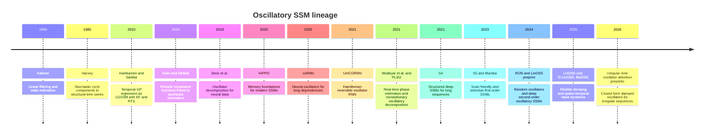

# Architecture

`linoss-dynamics` is a pure runtime primitive package.

## Layers

| Layer | Files | Responsibility |
| --- | --- | --- |
| Public API | `src/linoss_dynamics/__init__.py` | Re-export stable functions and errors. |
| Solver core | `src/linoss_dynamics/solver.py` | NumPy stepping, damping, energy, validation, and convergence helpers. |
| Package tests | `tests/test_solver.py` | Verify package behavior without host-application imports. |

## Boundary

Inputs:

- `y`, `z`: oscillator position and velocity arrays
- `A`: stiffness/frequency parameter
- `G` or `damping`: explicit non-negative damping
- `dt`: timestep
- optional `B`, `u`: forcing matrix/vector and input

Outputs:

- `y_next`, `z_next`
- metrics dict with mode, energy, signed energy delta, and damping mode

## Non-Dependencies

The package core must not depend on:

- host service getters
- FastAPI
- Graphiti
- Neo4j
- EventBus
- metacognitive-runtime or agent-framework objects
- JAX or Discretax

## Host Relationship

Host applications should depend on this package through normal Python package
installation and keep host-specific adapters outside the package core.

## Module Map (v0.2.0)

| Layer | Files | Responsibility |
| --- | --- | --- |
| Public API | `src/linoss_dynamics/__init__.py` | Re-export stable functions and errors. |
| Solver core | `src/linoss_dynamics/solver.py` | NumPy stepping, damping, energy, validation, convergence, and scan helpers. |
| Stability | `src/linoss_dynamics/stability.py` | Stability predicates, eigenvalue/frequency conversion, oscillator block builders. |
| Continuous | `src/linoss_dynamics/continuous.py` | Closed-form analytic step for irregular-time damped harmonic oscillators. |
| Discretize | `src/linoss_dynamics/discretize.py` | van Loan matrix-exponential discretization; ZOH control input discretization. Gated behind scipy. |
| Filters | `src/linoss_dynamics/filters.py` | Linear-Gaussian Kalman filter and RTS smoother. |
| Fit | `src/linoss_dynamics/fit.py` | MLE parameter recovery for damped oscillator SSMs. Gated behind scipy. |

## Lineage

This package sits in a research lineage that traces from Kalman (1960) through state-space GP and structural time-series work to the modern deep oscillatory SSM family (LinOSS, D-LinOSS).

